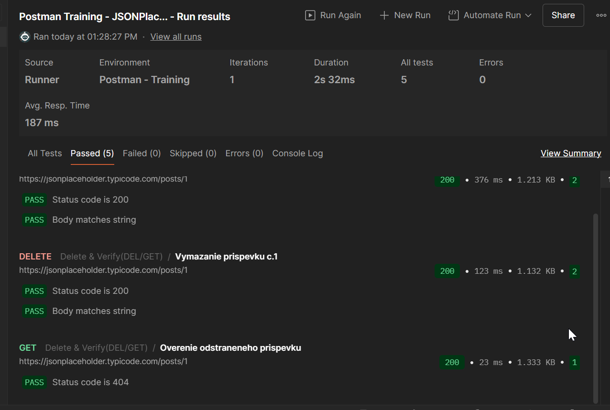
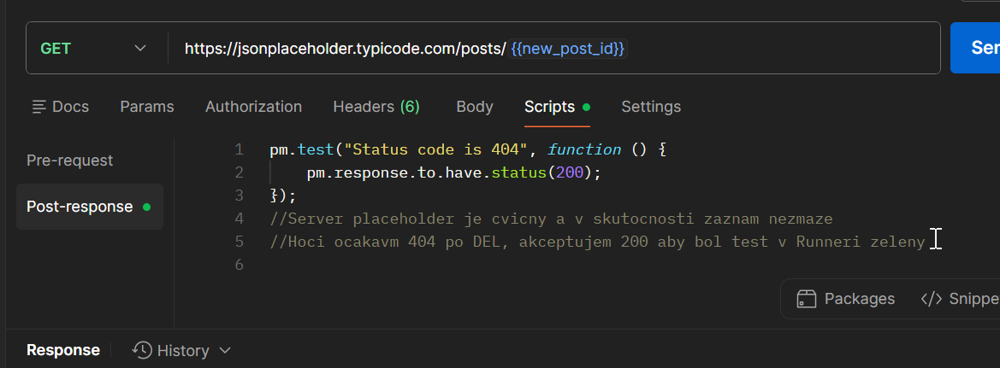
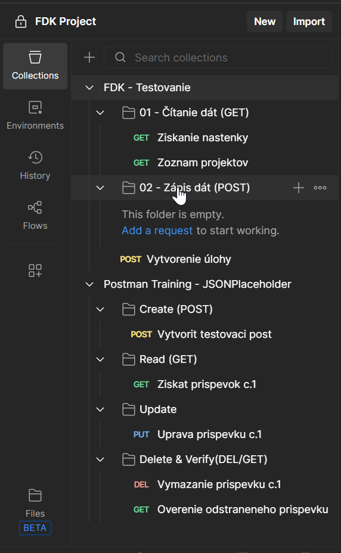

# Postman API Testing Portfolio

Tento repozitár slúži ako ukážka mojich zručností v oblasti manuálneho a automatizovaného testovania API pomocou nástroja **Postman**. Obsahuje reálne scenáre zamerané na bezpečnosť, automatizáciu a diagnostiku API.

## 🚀 Čo tento projekt obsahuje

### 1. FDK Project - Testovanie reálneho prostredia
V tejto časti demonštrujem prácu so zabezpečeným systémom.
* **Bezpečnosť:** Spracovanie **CSRF tokenov** a **Session Cookies**.
* **Environment Setup:** Profesionálne pripravené prostredie (Environment) s prázdnymi hodnotami pre bezpečnú distribúciu.
* **Štruktúra:** Logické rozdelenie na čítanie (`01 - Čítanie dát`) a zápis (`02 - Zápis dát`).

### 2. JSONPlaceholder - Automated CRUD Lifecycle
Ukážka plne automatizovaného reťazca požiadaviek (Dynamic Chaining).
* **Kompletný cyklus:** POST (vytvorenie), GET (čítanie), PUT (úprava), DELETE (zmazanie).
* **Dynamické premenné:** Automatické prepojenie requestov cez `{{new_post_id}}`.
* **Analytické testy:** - Overovanie status kódov.
  - Validácia obsahu JSON odpovede.
  - Vlastná logika pre prípady, kedy server dáta reálne nemaže (akceptácia kódu 200 namiesto 404).

## 📸 Ukážka výsledkov a logiky

### Úspešné vykonanie testov (Runner)
Tu je potvrdenie, že celý automatizovaný cyklus prebehol úspešne:

### Logika a skripty
Ukážka môjho postupu pri riešení špecifického správania servera pomocou JavaScriptu a komentárov:

### Štruktúra kolekcií v Postmane
Prehľadné usporiadanie práce pre lepšiu udržiavateľnosť testov:

## 🛠️ Inštrukcie na použitie
1. Stiahnite si súbory `.json` z hlavného priečinka tohto repozitára.
2. V Postmane zvoľte **Import** a nahrajte kolekcie aj súbory prostredí.
3. Pre FDK testy nezabudnite v sekcii **Environments** doplniť vlastné platné `moje_cookie` a `csrf_token`.
4. Spustite testy pomocou **Collection Runner**.
